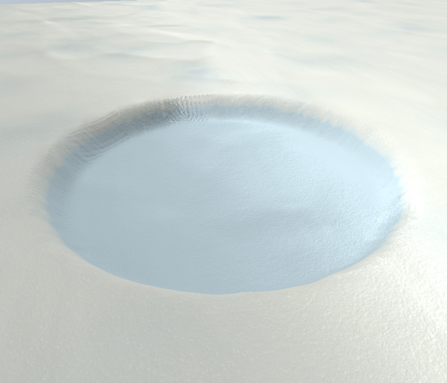
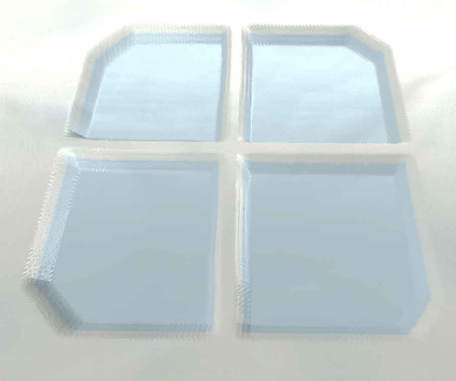

# SnowShader
Шейдер снега для Unity HDRP/Shader Graph.

## Особенности
- Деформация снега на основе Render Texture.
- Совместимость с High Definition Render Pipeline (HDRP).
- Настраиваемые параметры:
  
 
MainTexture - основная текстура снега.  
Metallic - металик  
BaseMapTiling - тайлинг MainTexture  
Bottom Color - цвет нижней части снега при деформации.  
Normal Texture - текстура нормали снега.  
NormalMapTiling - тайлинг NormalMap.  
NormalStength - сила карты нормали.  
HeightMap - карта высот (текстура) для деформации (RenderTexture).  
HeightMultiplier - высота снега.  
BottomHeight - переменная для определения высоты цвета при деформации.  
EdgeFadeStart - в процессе.  
EdgeFadeEnd - в процессе.  
Splat Dissolve - переменная для размытия границ при деформации. В основном в диапазоне [0,1]  
Noise Texture - текстура шума.  
Noise Tiling - тайлинг для Noise Texture.  
Noise Sparkling - в процессе.  
Tesselation Factor - сила тесселяции.  
 
## Скриншоты

# Предупреждения
Для корректной работы шейдера текстура кисти должна использовать Wrap Mode, отличный от Repeat, и не должна касаться своих собственных краев. Background кисти должен быть белым.

# ENG
# SnowShader
Snow shader for Unity HDRP/Shader Graph.

## Features
- Snow deformation based on Render Texture.
- Compatible with High Definition Render Pipeline (HDRP).
- Configurable parameters:
 
MainTexture - the main texture of snow.  
Metallic - metallic  
BaseMapTiling - tiling MainTexture  
Bottom Color - the color of the lower part of the snow during deformation.  
Normal Texture - the texture of the snow normality.  
NormalMapTiling - NormalMap tiling.  
NormalStength - the strength of the normal map.  
HeightMap is a height map (texture) for the deformation (RenderTexture).  
HeightMultiplier - the height of the snow.  
BottomHeight is a variable for determining the height of a color during deformation.  
EdgeFadeStart is in progress.  
EdgeFadeEnd is in progress.  
Splat Dissolve is a variable for blurring borders during deformation. Mostly in the range of [0.1]  
Noise Texture - noise texture.  
Noise Tiling - tiling for Noise Texture.  
Noise Sparkling is in progress.  
Tesselation Factor - the power of tessellation.  

# Warnings
For the shader to work correctly, the brush texture must use a Wrap Mode other than Repeat, and it must not touch its own edges. The background of the brush should be white.
